# J1 Test MEN

A collection of Node.js, Express.js, MongoDB, Mongoose, and EJS practical implementations covering core backend development concepts, CRUD operations, MVC architecture, middleware usage, templating engines, and responsive Bootstrap user interfaces.

---

# Features

- Built-in Node.js Modules (OS, FS, HTTP)
- HTTP Server Creation
- MongoDB Integration with Mongoose
- CRUD Operations
- Express.js Routing
- Express Middleware
  - express.json()
  - express.urlencoded()
- MVC Architecture
- EJS Templating Engine
- Bootstrap Responsive UI
- Dynamic JSON Data Rendering
- Product Cards and Tables
- Static File Serving using express.static()
- Arithmetic Calculator using EJS
- Form Handling and Data Processing

---

# Technologies Used

## Backend
- Node.js
- Express.js
- MongoDB
- Mongoose

## Frontend
- HTML5
- CSS3
- Bootstrap 5
- EJS

## Development Tools
- Visual Studio Code
- Git
- GitHub

---

# Installation Steps

## 1. Clone the Repository

```bash
git clone https://github.com/harshgupta73/j1_test_men.git
```

## 2. Navigate to Project Directory

```bash
cd j1_test_men
```

## 3. Install Dependencies

```bash
npm install
```

## 4. Start the Application

```bash
node app.js
```

## 5. Open Browser

```text
http://localhost:4000
```

---

# Project Structure

```text
j1_test_men
│
├── PartA_node
├── PartB_Crud
├── PartC_Express
├── PartD_MVC
├── PartE_EJS
├── screenshots
├── package.json
└── README.md
```

---

# Part A – Node.js Built-in Modules

Demonstrates the usage of Node.js built-in modules such as:

- OS Module
- File System (FS) Module
- HTTP Module

The HTTP module is used to create a basic server and render a simple user interface.

### Screenshots

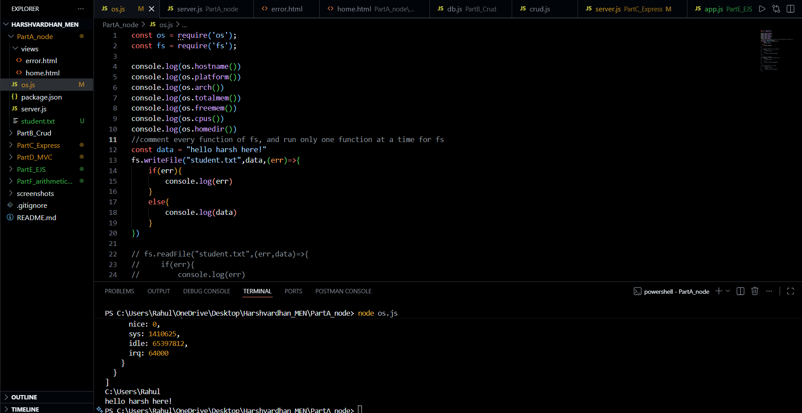

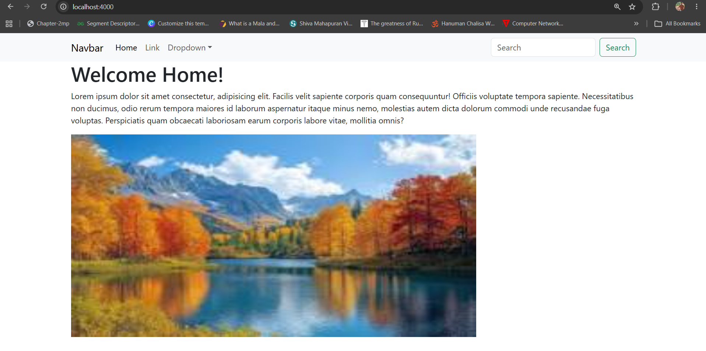

---

# Part B – CRUD Operations using Mongoose

Implementation of Create, Read, Update, and Delete operations using:

- MongoDB
- Mongoose ODM

### Screenshots

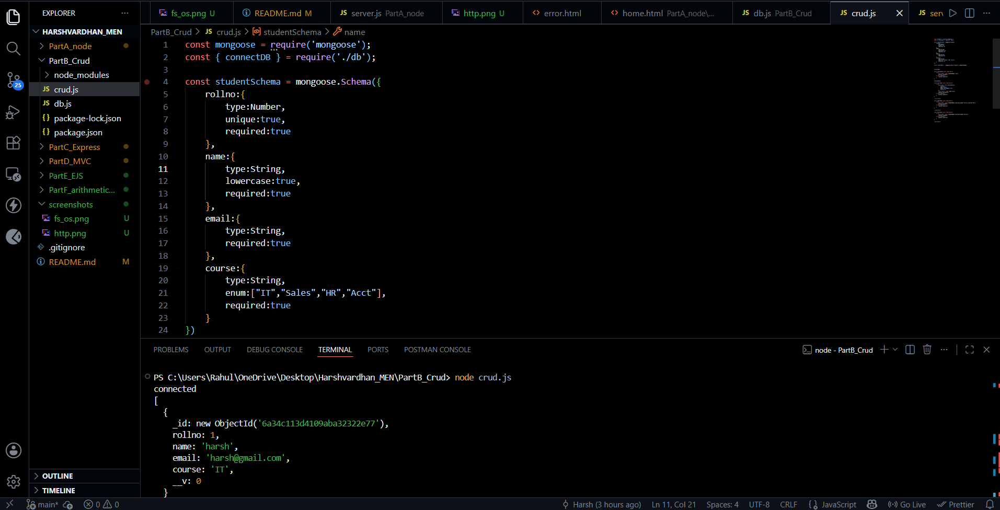

---

# Part C – Express.js Application

Implementation of a basic Express.js application with routing and middleware support.

### Concepts Covered

- Express Routing
- express.json()
- express.urlencoded()
- GET Requests
- POST Requests

### Screenshots

#### Home Page

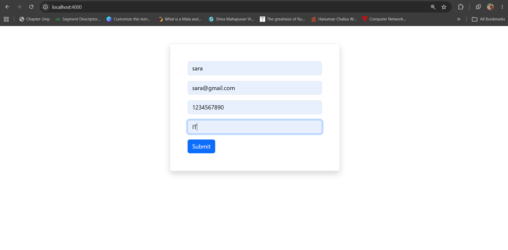

#### JSON Middleware

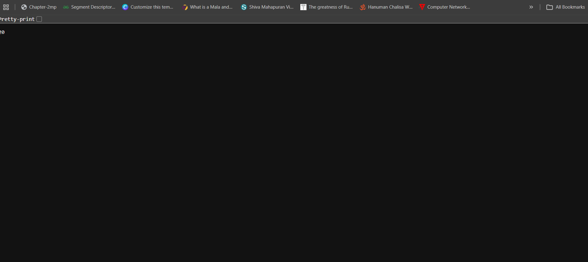

#### URL Encoded Middleware

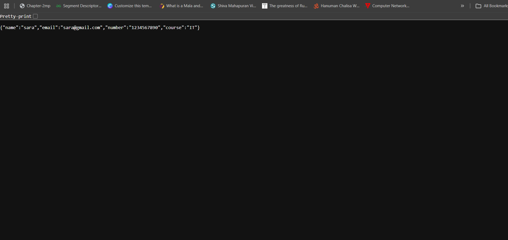

#### About Page

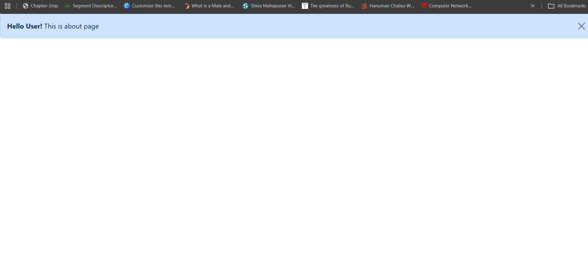

#### Contact Page


---

# Part D – MVC CRUD Application

Implementation of CRUD operations using the MVC (Model-View-Controller) architecture.

### Features

- Create Records
- Update Records
- Delete Records
- Display Records

### Screenshots

#### Insert Operation

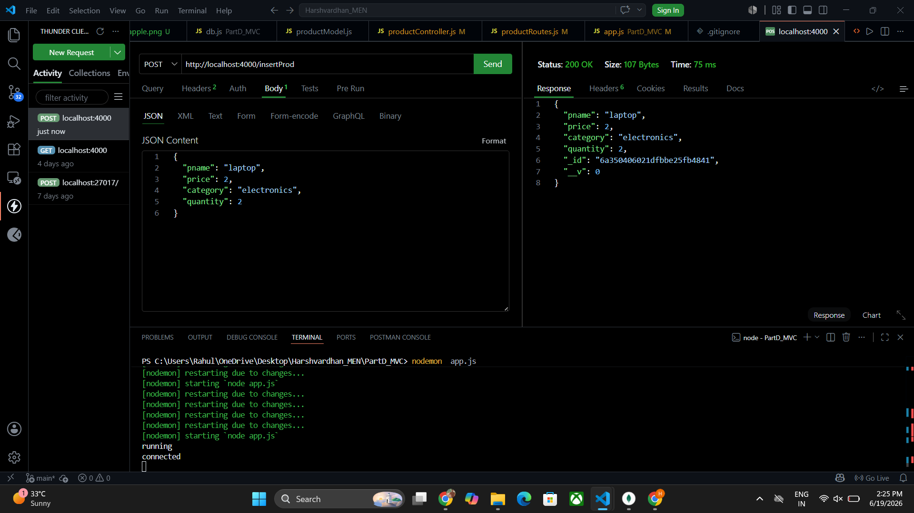

#### Update Operation


#### Delete Operation

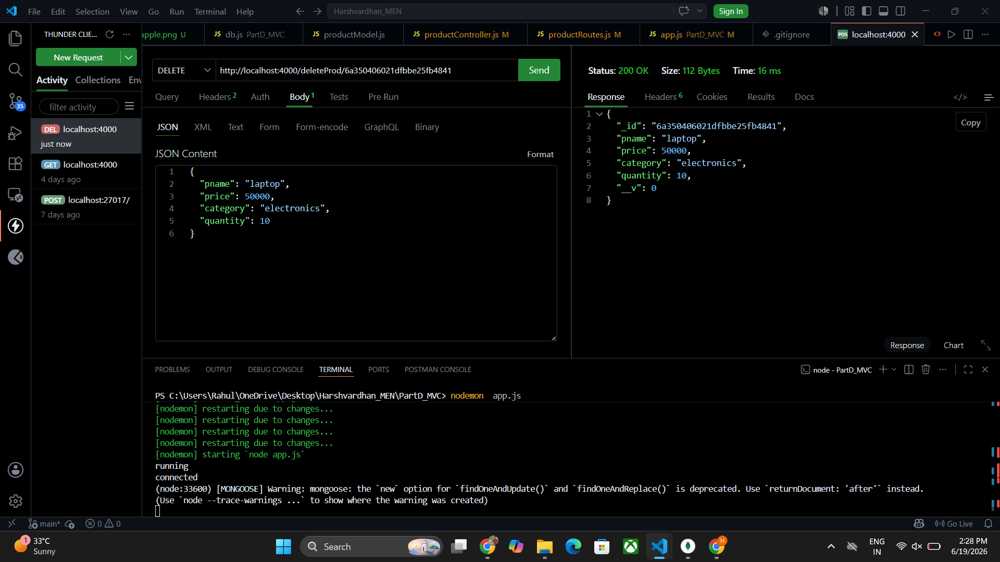

#### Display Records

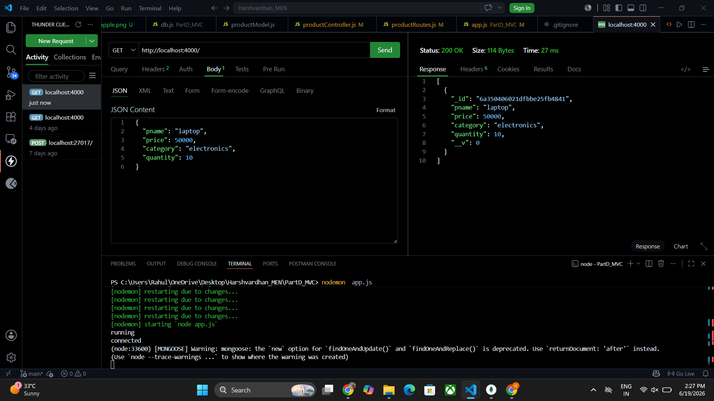

---

# Part E – EJS Templating Engine

Demonstrates dynamic rendering of JSON data using EJS templates and Bootstrap components.

### Features

- Bootstrap Cards
- Bootstrap Tables
- Responsive Design
- Dynamic Data Rendering

### Screenshots

#### Product Table

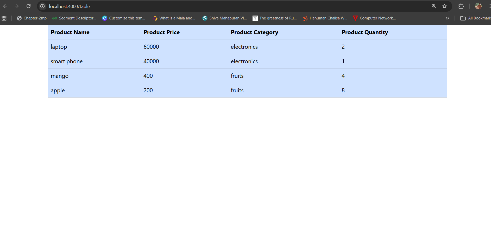

#### Product Cards using Online Images

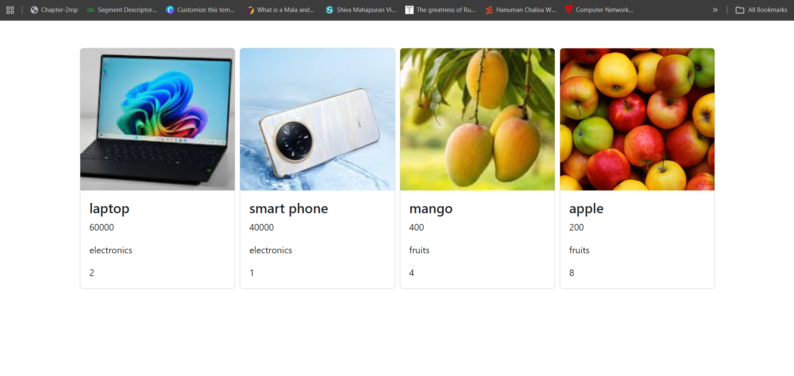

#### Product Cards using Local Images and express.static()

The screenshot below demonstrates serving local images using Express static middleware.

```javascript
app.use(express.static("public"));
```

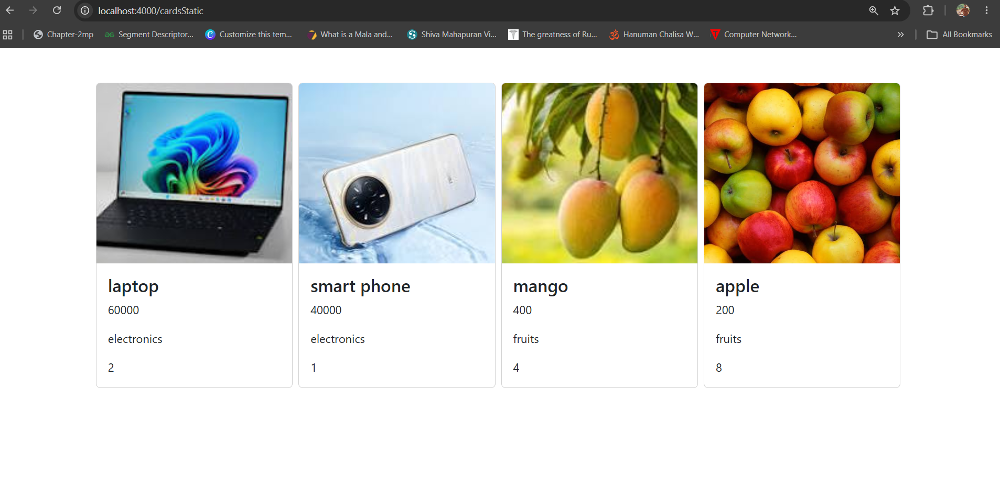

---

# Part F – Arithmetic Calculator using EJS

A calculator application developed using Express.js and EJS.

### Operations Supported

- Addition
- Subtraction
- Multiplication
- Division

### Screenshots

#### Calculator UI

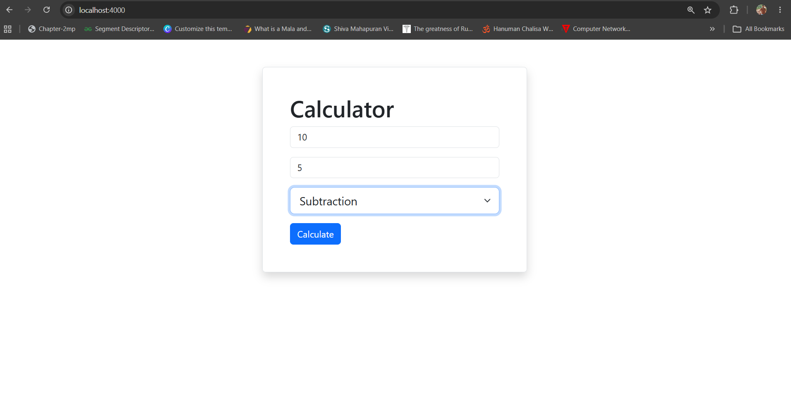

#### Calculator Result

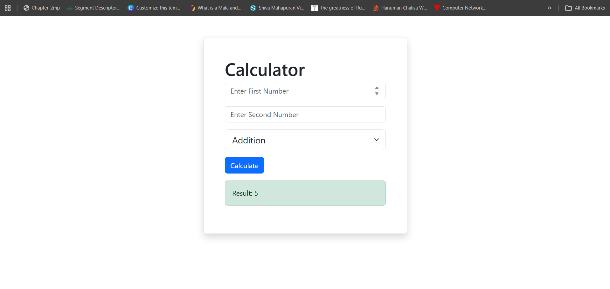

---

# Author Information

### Harshvardhan Gupta

- BE Computer Engineering
- Full Stack Web Development Enthusiast
- MERN Stack Learner

### GitHub

https://github.com/harshgupta73

### LinkedIn

https://www.linkedin.com/in/harshvardhan-gupta-b10308397

---

# Future Enhancements

- React Frontend Integration
- Authentication and Authorization
- RESTful API Development
- Deployment on Cloud Platforms
- Advanced MongoDB Features
- Full MERN Stack Applications

---